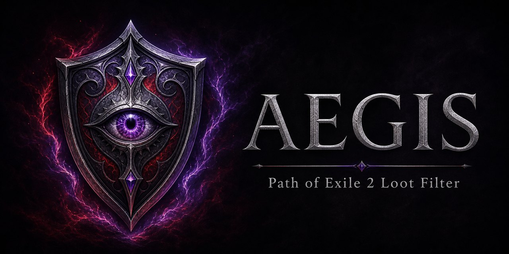

# Aegis

<p align="center">
  
</p>

Filtre de loot original pour **Path of Exile 2**, conçu pour le **Softcore Trade endgame**.

> Statut : en développement actif — version actuelle du filtre : **0.2.5**.

## Objectif

Aegis est un filtre **TradeStrict+** : il vise à réduire fortement le bruit visuel tout en conservant les objets utiles, recherchés ou incertains pour le commerce.

Ses priorités actuelles sont :

- économie et objets endgame ;
- builds caster / Spirit Walker ;
- équipements avec Energy Shield, y compris les bases hybrides ;
- sécurité : en cas de doute sur la valeur d'un objet, le filtre privilégie l'affichage plutôt que le masquage.

## Fonctionnement actuel

| Catégorie | Comportement |
| --- | --- |
| Monnaies | Paliers visuels S+ à C ; or sous 700 masqué et piles de 2 000+ mises en avant. Alchemy, Chaos, Exalted et Greater Regal reçoivent un style jaune clair avec son léger ; Orb of Annulment, Transmutation parfaite et Augmentation parfaite sont au palier S. |
| Gemmes brutes | Gemmes d'Aptitude et d'Esprit affichées à partir du niveau 17 ; niveau 20 au palier S+. |
| Runes | Runes premium mises en avant ; autres socketables conservés par sécurité. |
| Waystones | T15 et T16 affichées avec une priorité élevée. |
| Équipement rare | Tous les rares à partir de l'ilvl 81 sont affichés, ainsi que les rares possédant de l'Energy Shield. Les armes de caster rares ilvl 81+ sont également retenues. |
| Affixes T1–T5 | Les objets non identifiés T1 à T3 restent visibles avec un libellé plus discret ; les T4/T5 sont mis en avant en bleu. |
| Bases blanches ES | Les bases normales Energy Shield et hybrides ES de niveau de drop 80+ sont conservées. |
| Uniques | Tous les uniques restent visibles. Les bases de chase uniques rares sont au palier S, les très rares au palier S+ avec faisceau et un son renforcé. Les bagues et amulettes restent toujours visibles. |
| Joyaux | Toujours affichés pour préserver les opportunités de trade et de build. |
| Rituel et Brèche | Breachstone, tablettes, Wombgifts et présages de Rituel sont affichés en bleu foncé avec un son léger. |
| Qualité exceptionnelle | Les objets normaux, magiques et rares à 21 % de qualité ou plus sont mis en avant. |
| Contenu endgame | Tablettes, fragments et reliques affichés ; les Logbooks d'Expédition sont au palier S+. |
| Abyss | Omen of Abyssal Echoes et Omen of Light reçoivent un style S+ sur fond blanc et un son strident. |
| Essais | Djinn Barya et Inscribed Ultimatum masqués. |
| Reste du butin | Masqué par la règle finale du filtre. |

## Niveaux visuels

| Niveau | Couleur | Usage |
| --- | --- | --- |
| S+ | Rouge / violet | Objets exceptionnels. |
| S | Orange foncé | Objets de très haute valeur ou priorité. |
| A | Jaune | Objets endgame importants. |
| B | Bleu | Objets utiles ou de valeur intermédiaire. |
| C | Blanc | Objets conservés par prudence. |

Les niveaux **S+** et **S** déclenchent également un son.

## Installation

1. Télécharge [Aegis.filter](Aegis.filter).
2. Copie le fichier dans le dossier de filtres de Path of Exile 2 :

   ```text
   Documents\My Games\Path of Exile 2
   ```

3. Dans le jeu, ouvre les options puis l'onglet **UI**.
4. Sélectionne `Aegis.filter` dans la liste des filtres d'objets.

Après une mise à jour, remplace simplement l'ancien fichier par la nouvelle version puis recharge-le dans les options du jeu.

## Développement

Le projet est volontairement maintenu dans un seul fichier : [`Aegis.filter`](Aegis.filter). Cela permet de lire et d'ajuster les règles directement, sans générateur ni étape de compilation.

Les évolutions prévues sont notamment :

- liste manuelle des chase uniques ;
- affinage des niveaux économiques selon l'utilité durable ;
- règles plus précises pour les bases ES et hybrides ;
- ajustements après tests en jeu.

## Versions

Les commits enregistrent les évolutions du projet. Une **release GitHub** est créée pour chaque version testée et prête à être utilisée, afin de pouvoir télécharger facilement une version stable d'Aegis.

La version stable actuelle est **Aegis v0.2.5**.

## Crédits

- **FAILiZZZZZZ** : création et suivi du projet.
- **★BungeeGum💧** : direction de jeu, priorités économiques et retours de test.
- **ChatGPT** : assistance technique et maintenance du filtre.
